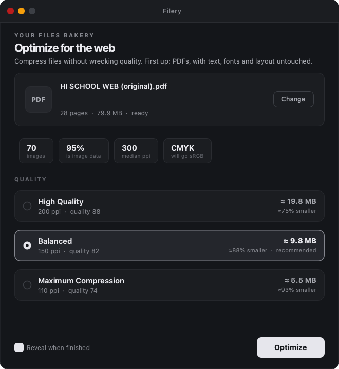

<p align="center">
  
</p>

<h1 align="center">Filery</h1>

<p align="center"><b>Optimize and compress your files for the web.</b></p>

Filery shrinks bloated files down to web-friendly sizes without wrecking their
quality. The first module handles **PDFs** (typically **~90% smaller**), with images,
video and format conversion planned as further modules.

On a real 28-page print supplement it turned **79.9 MB into 7.1 MB (91.1%
smaller)** with no visible difference at normal reading zoom, and without touching a
single character of text.



## Why print PDFs are so big

Almost never the text. On the file above, **95% of the bytes were images**, and every
one was CMYK at 300 to 411 ppi. That is correct for a printing press and pure waste on a
web page:

| | Print master | What the web needs |
|---|---|---|
| Colour | CMYK (4 channels) | RGB (3 channels), 25% smaller before any quality loss |
| Resolution | 300 to 400 ppi | ~150 ppi is retina-sharp at full-page zoom |
| Encoding | Lossless / high-quality JPEG | Visually-lossless JPEG |

## What the PDF module does

- **Converts CMYK to sRGB.** Drops a whole channel, and makes colour render
  *consistently* across browsers instead of leaving each viewer to interpret
  DeviceCMYK on its own.
- **Downsamples to real placement, not nominal DPI.** It measures where each image
  actually lands on the page. A 411 ppi image dropped into a small frame is *more*
  over-resolution than its metadata claims; a full-bleed one may be less. Nothing is
  ever upscaled.
- **Picks the codec per image.** Photographs get baseline JPEG. Line art, logos, charts
  and screenshots (256 colours or fewer, or an indexed palette) stay **lossless**,
  because JPEG rings around hard edges.
- **Detects images that are secretly greyscale** and stores one channel instead of three.
- **Strips** metadata, XML metadata, thumbnails and unused objects.
- **Linearizes** for Fast Web View, so pages render while the file is still downloading.

### What it never does

- Rasterize, subset or re-encode text. Fonts stay embedded exactly as they were.
- Change page size, order, margins, layout, links, bookmarks or annotations.
- Convert vectors to images, or upscale anything.

The test suite enforces these as invariants.

## Quality levels

| Profile | Target | Result on the sample | SSIM |
|---|---|---|---|
| High Quality | 200 ppi, q88 | 14.1 MB (-82.4%) | 0.993 |
| **Balanced** (default) | 150 ppi, q82 | **7.1 MB (-91.1%)** | **0.987** |
| Maximum Compression | 110 ppi, q74 | 4.8 MB (-94.0%) | 0.977 |

SSIM is measured per page against the original render; 1.0 is identical. Text-only pages
score exactly **1.0000**, so they come through untouched, which is the point.

## The one real trade-off

CMYK to RGB shifts mean colour by **1.4% or less (about 3.6/255)**, which is imperceptible
and unavoidable for web delivery. Verified against two independent renderers (MuPDF and
Poppler). **Keep your original as the print master**, since these outputs are
web-accurate but no longer press-ready.

## Install

Download a prebuilt app from [Releases](../../releases): macOS `.dmg` (Apple Silicon) or
Windows `.zip`. On macOS, drag Filery to Applications.

> The builds are unsigned. On macOS, right-click then Open the first time. On Windows,
> click "More info" then "Run anyway". Proper code-signing is on the roadmap.

Or run from source:

```bash
pip install -e ".[gui]"
filery-gui        # the app
filery input.pdf  # the CLI
```

## Command line

```bash
filery input.pdf                       # Balanced, writes "input - Balanced.pdf"
filery input.pdf -p max -o small.pdf
filery *.pdf --all                     # all three profiles for each file
filery input.pdf --analyze             # inspect only, change nothing
```

## Architecture

```
src/filery/
  app.py                 # PySide6 desktop UI (type-agnostic)
  cli.py                 # command line
  optimizers/
    __init__.py          # REGISTRY: extension maps to an optimizer module
    pdf.py               # the PDF engine
```

New media types are meant to land as sibling modules under `optimizers/`, each exposing
the same shape (`PROFILES` plus `optimize()` plus `analyze()`), so the UI and CLI do not
change.

## Building

PyInstaller **cannot cross-compile**, so each OS must build on itself:

```bash
pip install -e ".[gui,build]"
python packaging/make_icon.py                       # generates the icon
cd packaging && pyinstaller filery.spec --noconfirm
./make_dmg.sh                                        # macOS installer
```

`.github/workflows/build.yml` does this for macOS (Apple Silicon) and Windows on every
tag and attaches the results to a Release. One codebase, native builds, built by CI.

Intel Macs are deliberately not targeted: every Mac since Nov 2020 is Apple Silicon, and
Rosetta only translates x86 to ARM, never the reverse.

## Tests

```bash
pip install -e ".[dev]"
pytest -q
```

## Licence

**AGPL-3.0-or-later**, because it links [PyMuPDF](https://github.com/pymupdf/PyMuPDF)
(AGPL). If you distribute this app or a derivative, you must make your source available
under the AGPL too.

| Dependency | Licence |
|---|---|
| PyMuPDF | AGPL-3.0 |
| pikepdf | MPL-2.0 |
| Pillow | HPND |
| numpy | BSD-3 |
| PySide6 | LGPL-3.0 |
